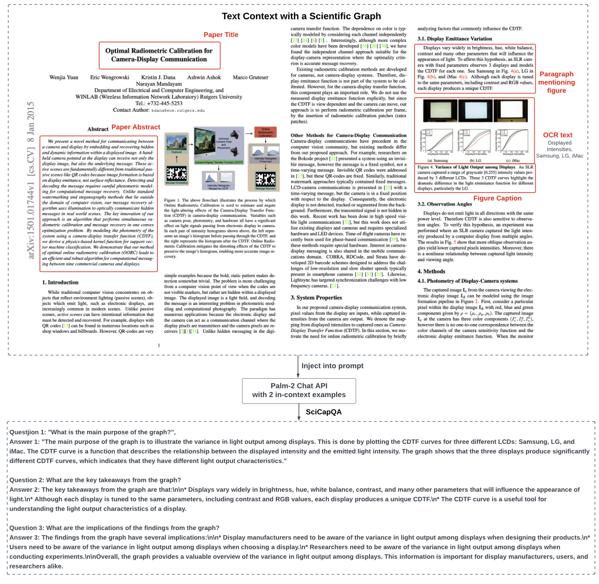
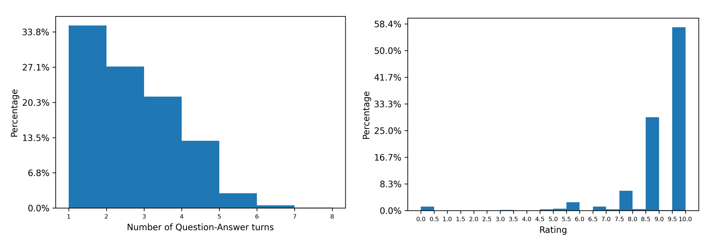
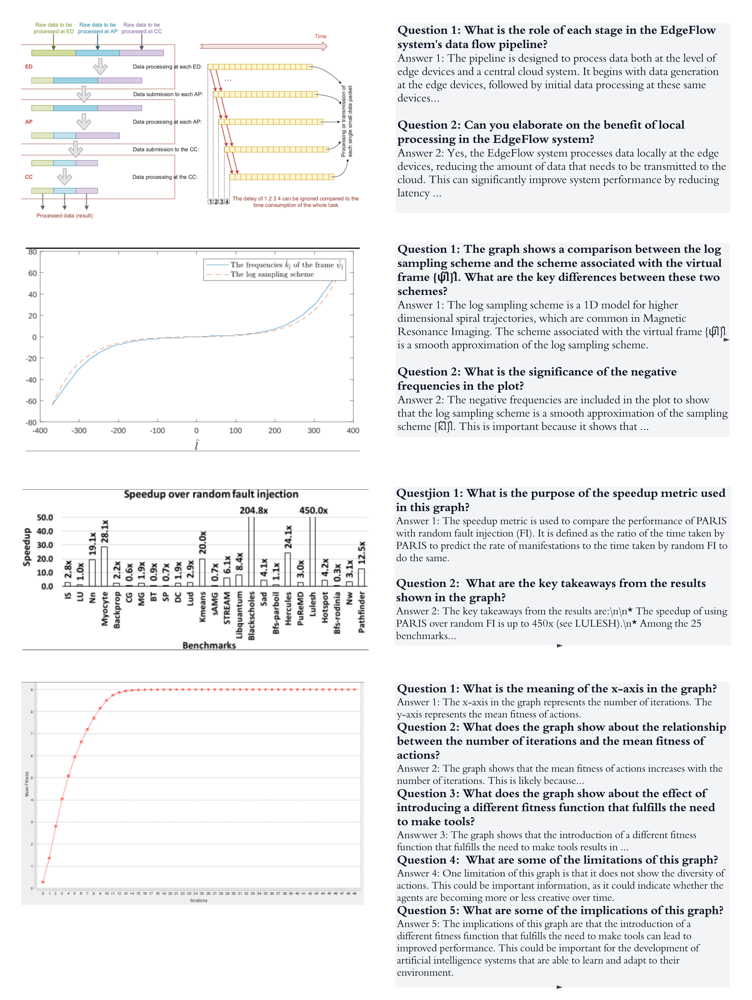

# A Large-Scale Synthetic Multi-Turn Question-Answering Dataset for Scientific Graphs


In this work, we present SciGraphQA, a synthetic multi-turn question-answer dataset related to
academic graphs. SciGraphQA is 13 times larger than ChartVQA, the previously largest chart-visual
question-answering dataset. It is also the largest open-sourced chart VQA dataset with non-synthetic
charts. To build our dataset, we selected 290,000 Computer Science or Machine Learning ArXiv
papers published between 2010 and 2020, and then used Palm-2 to generate 295K samples of open-
vocabulary multi-turn question-answering dialogues about the graphs. As context, we provided the
text-only Palm-2 with paper title, abstract, paragraph mentioning the graph, and rich text contextual
data from the graph itself, obtaining dialogues with an average 2.23 question-answer turns for each
graph. We asked GPT-4 to assess the matching quality of our question-answer turns given the paper’s
context, obtaining an average rating of 8.7/10 on our 3K test set.
We evaluated the 0-shot capability of the most popular MLLM models such as LLaVa, mPLUGowl,
BLIP-2, and openFlamingo’s on our dataset, finding LLaVA-13B being the most performant with a
CIDEr score of 0.08. We further enriched the question prompts for LLAVA by including the serialized
data tables extracted from the graphs using the DePlot model, boosting LLaVA’s 0-shot CIDEr to
0.15. To verify the validity of our dataset, we also fine-tuned LLaVa using our dataset, reaching a
substantially higher CIDEr score of 0.26. We anticipate further accuracy improvement by including
segmentation mask tokens and leveraging larger LLM backbones coupled with emergent prompting
techniques. 

[[Arxiv paper](https://arxiv.org/abs/2308.03349)]
[[Training Dataset](https://huggingface.co/datasets/alexshengzhili/SciGraphQA-295K-train/edit/main/README.md)]
[[Test Dataset](https://huggingface.co/datasets/alexshengzhili/SciCapInstructed-graph-only-qa)]
[[Model](https://huggingface.co/alexshengzhili/SciGraph-100-percent-further-ft-60k-interleaf-lora-merged)]
[[PaperWithCode Benchmark](https://paperswithcode.com/dataset/scigraphqa)]
```
@misc{li2023scigraphqa,
  title={SciGraphQA: A Large-Scale Synthetic Multi-Turn Question-Answering Dataset for Scientific Graphs}, 
  author={Shengzhi Li and Nima Tajbakhsh},
  year={2023},
  eprint={2308.03349},
  archivePrefix={arXiv},
  primaryClass={cs.CL}
}
```

**Usage and License Notices**: The data, code and checkpoint is intended and licensed for research use only. They are also restricted to uses that follow the license agreement of Palm-2, LLaMA and GPT-4. If you find our work useful, please consider citing us using


## Updates

[Oct 2024] We are updating the dataset with higher quality and grounded on input images, using MMLM as input instead of using text only llm. Stay tuned! 

## Contents
- [Data Download](#data-download)
- [Install](#install)
- [LLaVA-GRAPH Weights](#llava-weights)
- [Serving](#serving)
- [Evaluation](#evaluation)
- [Fine-tuning](#fine-tuning)

## Data

| Data file name | Size |
| --- | ---: |
| [[SciGraphQA-295K](https://huggingface.co/datasets/alexshengzhili/SciGraphQA-295K-train/edit/main/README.md)] | 771 MB (excluding images)
| [[SciGraphQA-3K-test](https://huggingface.co/datasets/alexshengzhili/SciCapQA-test-with-deplot)] | 8.4 MB (excluding images)
| [[SciGraphQA-30K-DePlot-augmented-subset](https://huggingface.co/datasets/alexshengzhili/SciCaptrain_10k-40k_deplot_conversations)] | 8.4 MB (excluding images)
### Related datasets
| Datasets | Figure Count | Data/Chart generation process | Question-Answer pair count | Question generation | Answer Type | # Plot types |
| --- | --- | --- | --- | --- | --- | --- |
| FigureQA (Kahou et al. 2017) | 180K | Synthetic data and charts | 2.3M | From 15 templates | Fixed voca. | 4 |
| DVQA (Kafle et al. 2018) | 300K | Synthetic data and synthetic charts | 3.4M | From 26 templates | Fixed vocab. | 1 |
| PlotQA (Methani et al. 2020) | 224K | Real-world data and synthetic charts | 28M | From 76 templates | Mix of fixed and open vocabulary answers. | 3 |
| ChartQA (Masry et al. 2022) | 21.9K (4.8K human and 17.1K generated) | Real-world charts from a web crawl | 32.7K (9.6K human and 23.1k generated) | Human/Machine generated | Open Vocabulary | Unbounded (real-world charts) |
| SciGraphQA (ours) | 295K | Real-world academic graphs | 657K | Machine Generated with Palm with additional textual context | Open Vocabulary | Unbounded (real-world charts) |

### Generation process


Illustration of multi-turn dialogue generation process. For higher quality dialogues, we use comprehensive textual context together with in-context learning when prompting Palm-2.


(left) distribution of the number of question-answer turns in our SciGraphQA dataset. (right) distribution of GPT-4 ratings (0--10) when GPT-4 was used as a judge to measure the matching of questions and answers from a 3k subset of the the SciGraphQA dataset.


Examples from our SciGraphQA dataset where questions and answers are both generated using a commercial LLM rather than being selected from a fixed, limited template pool. Note how the questions are specific to the graphs and often have a conversational nature, asking to elaborate on a concept mentioned in previous answer. For brevity, some answers are truncated, denoted by ``...`` at the end.

## Leaderboard 

| Model Name | Finetuned on SciGraphQA? | Prompt Augmented with extracted data-table | CIDEr | BLEU(4) | ROUGE |
| --- | --- | --- | --- | --- | --- |
| BLIP2-2.7B | No | No | 0.007 | 0.003 | 0.1 |
| DePlot+mPLUG-owl-7B | No | Yes | 0.037 | 0.058 | 0.22 |
| mPLUG-owl-7B | No | No | 0.04 | 0.062 | 0.22 |
| LLaVa-7B | No | No | 0.048 | 0.07 | 0.18 |
| LLaVa-13B | No | No | 0.08 | 0.07 | 0.23 |
| OpenFlamingo v2-7B | No | No | 0.12 | 0.081 | 0.22 |
| DePlot+GPT-3 | No | Yes | 0.13 | 0.098 | 0.226 |
| DePlot+LLaVa-13B | No | Yes | 0.153 | 0.106 | 0.273 |
| DePlot+SciGrahQA-baseline | Yes | Yes | **0.268** | **0.123** | **0.31** |
## Install

1. Clone this repository and navigate to LLaVA folder
```bash
git clone https://github.com/findalexli/LLaVA-Graph
cd LLaVA-Graph
```

2. Install Package
```Shell
conda create -n llava python=3.10 -y
conda activate llava
pip install --upgrade pip  # enable PEP 660 support
pip install -e .
pip install ninja
pip install flash-attn==1.0.2
```


## LLaVA Weights
```Shell

from transformers import AutoModelForCausalLM

model = AutoModelForCausalLM.from_pretrained("alexshengzhili/LLaVa-graph-caption-to-paragraph")
```


### LLaVA pretrained projector weights
The initial release is pretrained on [[SciCapPlus](https://huggingface.co/datasets/alexshengzhili/LLAVA-graph-OCRCleaned)] with 1 epoch.  The pretrained weights are released [here](https://huggingface.co/alexshengzhili/llava-7bv0-mm-projector-ft-with-ocr-caption-prompted-paragraph). 


## Serving

### Web UI

#### Launch a controller
```Shell
python -m llava.serve.controller --host 0.0.0.0 --port 10000
```

#### Launch a model worker
```Shell
python -m llava.serve.model_worker --host 0.0.0.0 --controller http://localhost:10000 --port 40000 --worker http://localhost:40000 --model-path alexshengzhili/LLaVa-graph-caption-to-paragraph --multi-modal
```
Wait until the process finishes loading the model and you see "Uvicorn running on ...".

#### Launch a model worker (Multiple GPUs, when GPU VRAM <= 24GB)

If your the VRAM of your GPU is less than 24GB (e.g., RTX 3090, RTX 4090, etc.), you may try running it with multiple GPUs.

```Shell
python -m llava.serve.model_worker --host 0.0.0.0 --controller http://localhost:10000 --port 40000 --worker http://localhost:40000 --model-path alexshengzhili/LLaVa-graph-caption-to-paragraph --multi-modal --num-gpus 2
```
Wait until the process finishes loading the model and you see "Uvicorn running on ...".

#### Launch a gradio web server.
```Shell
python -m llava.serve.gradio_web_server --controller http://localhost:10000
```
#### You can open your browser and chat with a model now.


### Code and Hyperparameters
We fine-tune the model using the code from [FastChat](https://github.com/lm-sys/FastChat). We use a similar set of hyperparameters as Vicuna in finetuning.  Both hyperparameters used in pretraining and finetuning are provided below.

1. Pretraining

| Hyperparameter | Global Batch Size | Learning rate | Epochs | Max length | Weight decay |
| --- | ---: | ---: | ---: | ---: | ---: |
| LLaVA-13B | 128 | 2e-3 | 1 | 2048 | 0 |

2. Finetuning

| Hyperparameter | Global Batch Size | Learning rate | Epochs | Max length | Weight decay |
| --- | ---: | ---: | ---: | ---: | ---: |
| LLaVA-13B | 32 | 2e-5 | 3 | 2048 | 0 |

### Fine-tuning with Local GPUs
LLaVA-Graph is trained on 8 A100 GPUs with 80GB memory with the following code. To train on fewer GPUs, you can reduce the `per_device_train_batch_size` and increase the `gradient_accumulation_steps` accordingly to keep the global batch size the same.

1. Pretraining

<details>
<summary>Pretrain: LLaVA-13B, 8x A100 (80G).  Time: ~4 hours.</summary>

```Shell
torchrun --nnodes=1 --nproc_per_node=8 --master_port=25001 \
    llava/train/train_mem.py \
    --model_name_or_path ./checkpoints/llama-vicuna-13b \
    --data_path /path/to/cc3m_595k.json \
    --image_folder /path/to/cc3m_595k \
    --vision_tower openai/clip-vit-large-patch14 \
    --tune_mm_mlp_adapter True \
    --mm_vision_select_layer -2 \
    --mm_use_im_start_end \
    --bf16 True \
    --output_dir ./checkpoints/llava-13b-pretrain \
    --num_train_epochs 1 \
    --per_device_train_batch_size 16 \
    --per_device_eval_batch_size 4 \
    --gradient_accumulation_steps 1 \
    --evaluation_strategy "no" \
    --save_strategy "steps" \
    --save_steps 2400 \
    --save_total_limit 1 \
    --learning_rate 2e-3 \
    --weight_decay 0. \
    --warmup_ratio 0.03 \
    --lr_scheduler_type "cosine" \
    --logging_steps 1 \
    --tf32 True \
    --model_max_length 2048 \
    --gradient_checkpointing True \
    --lazy_preprocess True \
    --report_to wandb
```
</details>

You may run this with a single A100 GPU with the following code.  Please note that the `per_device_train_batch_size` * `gradient_accumulation_steps` should be equal to 128 to keep the global batch size the same.


<details>
<summary>Pretrain: LLaVA-7B, 1x A100 (80G/40G).  Time: ~19 hours.</summary>

```Shell
python llava/train/train_mem.py \
    --model_name_or_path ./checkpoints/llama-vicuna-7b \
    --data_path /path/to/cc3m_595k.json \
    --image_folder /path/to/cc3m_595k \
    --vision_tower openai/clip-vit-large-patch14 \
    --tune_mm_mlp_adapter True \
    --mm_vision_select_layer -2 \
    --mm_use_im_start_end \
    --bf16 True \
    --output_dir ./checkpoints/llava-7b-pretrain \
    --num_train_epochs 1 \
    --per_device_train_batch_size 16 \
    --per_device_eval_batch_size 4 \
    --gradient_accumulation_steps 8 \
    --evaluation_strategy "no" \
    --save_strategy "steps" \
    --save_steps 2400 \
    --save_total_limit 1 \
    --learning_rate 2e-3 \
    --weight_decay 0. \
    --warmup_ratio 0.03 \
    --lr_scheduler_type "cosine" \
    --logging_steps 1 \
    --tf32 True \
    --model_max_length 2048 \
    --gradient_checkpointing True \
    --lazy_preprocess True \
    --report_to wandb
```
</details>


## Acknowledgement
- [LLaVA] which the codebase we built on
- [Vicuna](https://github.com/lm-sys/FastChat): the codebase we built upon, and our base model Vicuna-13B that has the amazing language capabilities!

## Related Projects

- [Instruction Tuning with GPT-4](https://github.com/Instruction-Tuning-with-GPT-4/GPT-4-LLM)
- [LLaVA-Med: Training a Large Language-and-Vision Assistant for Biomedicine in One Day](https://github.com/microsoft/LLaVA-Med)
- [Otter: In-Context Multi-Modal Instruction Tuning](https://github.com/Luodian/Otter)

For future project ideas, pleae check out:
- [SEEM: Segment Everything Everywhere All at Once](https://github.com/UX-Decoder/Segment-Everything-Everywhere-All-At-Once)
- [Grounded-Segment-Anything](https://github.com/IDEA-Research/Grounded-Segment-Anything) to detect, segment, and generate anything by marrying [Grounding DINO](https://github.com/IDEA-Research/GroundingDINO) and [Segment-Anything](https://github.com/facebookresearch/segment-anything).
